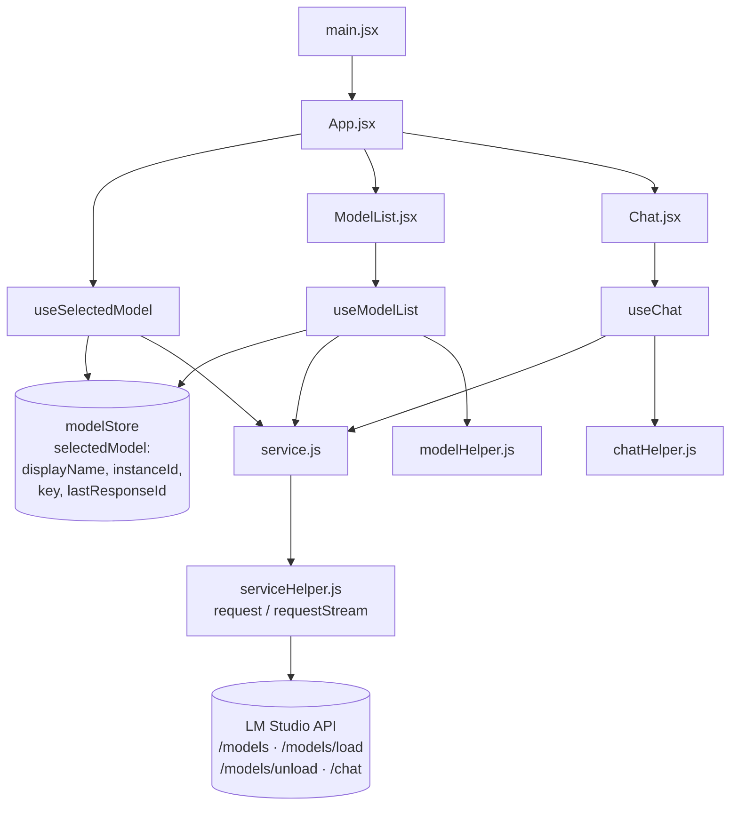
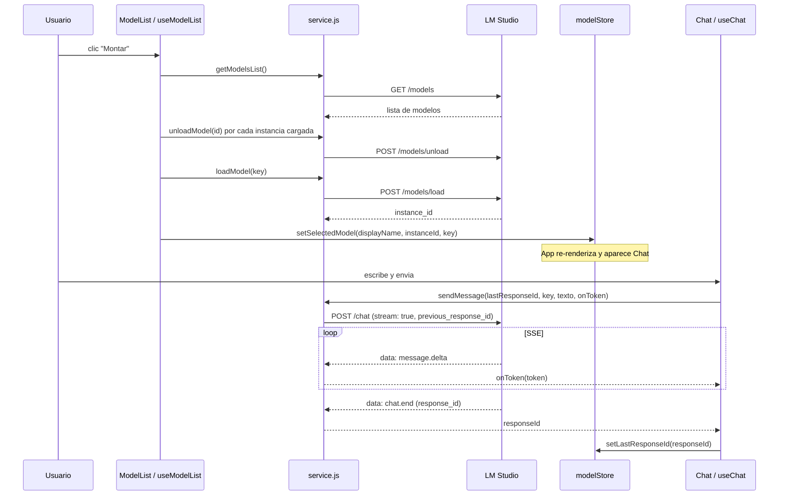

# Arquitectura de Mini Chat IA

Mini Chat IA es una SPA de React que consume la API local de LM Studio para
listar, montar y desmontar modelos, y para chatear con el modelo activo
usando streaming.

## Capas

## Flujo completo

## Modelo de estado

El estado vive en dos lugares distintos, y esa division es central:

| Estado | Ubicacion | Alcance |
| --- | --- | --- |
| `selectedModel` (`displayName`, `instanceId`, `key`, `lastResponseId`) | `src/store/modelStore.js` (Zustand) | Compartido entre componentes |
| `messages`, `currentMessage`, `isSending` | `src/component/useChat.js` | Local al chat |
| `models`, `loadingKey` | `src/component/useModelList.js` | Local a la lista de modelos |
| `isUnloading` | `src/component/useSelectedModel.js` | Local al boton de desmontar |

`lastResponseId` es el hilo de la conversacion: se guarda en el store y vuelve
como `previous_response_id` en el siguiente request a `/chat`.

## Endpoints

| Operacion | Metodo | Path | Consumidor |
| --- | --- | --- | --- |
| Listar modelos | `GET` | `/models` | `getModelsList` |
| Montar modelo | `POST` | `/models/load` | `loadModel` |
| Desmontar modelo | `POST` | `/models/unload` | `unloadModel` |
| Enviar mensaje | `POST` | `/chat` | `sendMessage` (streaming SSE) |

La URL base sale de `VITE_API_BASE_URL` y cae por defecto en
`http://192.168.1.68:1234/api/v1` (`src/constants/appConstants.js`).

## Mapa de archivos

| Archivo | Responsabilidad |
| --- | --- |
| `src/main.jsx` | Punto de entrada; monta `App`. |
| `src/App.jsx` | Layout general; decide si renderizar `Chat` segun el modelo seleccionado. |
| `src/component/ModelList.jsx` | Renderiza la lista de modelos y el boton "Montar". |
| `src/component/Chat.jsx` | Renderiza mensajes y el input; usa `react-markdown`. |
| `src/component/useModelList.js` | Carga, refresca y monta modelos; desmonta al desmontar el componente. |
| `src/component/useChat.js` | Envia mensajes y acumula tokens del stream en el mensaje del asistente. |
| `src/component/useSelectedModel.js` | Expone el modelo seleccionado y la accion de desmontarlo. |
| `src/store/modelStore.js` | Store Zustand con `selectedModel` y sus setters. |
| `src/service/service.js` | Define las operaciones de dominio contra la API. |
| `src/helper/serviceHelper.js` | `request` / `requestStream`, manejo de errores (`ApiRequestError`). |
| `src/helper/modelHelper.js` | Normaliza modelos y extrae instancias cargadas. |
| `src/helper/chatHelper.js` | Construye mensajes de usuario y de asistente. |
| `src/helper/toastMessages.js` | Textos de las notificaciones. |
| `src/constants/appConstants.js` | URL base, paths, operaciones y estado vacio. |

## Notas

- El streaming se parsea a mano en `requestStream`: se corta el buffer por
  lineas y se procesan las que empiezan con `data:` como SSE.
- `reasoning.delta` se ignora a proposito; ver el comentario en
  `src/service/service.js` si se usan modelos con razonamiento.
