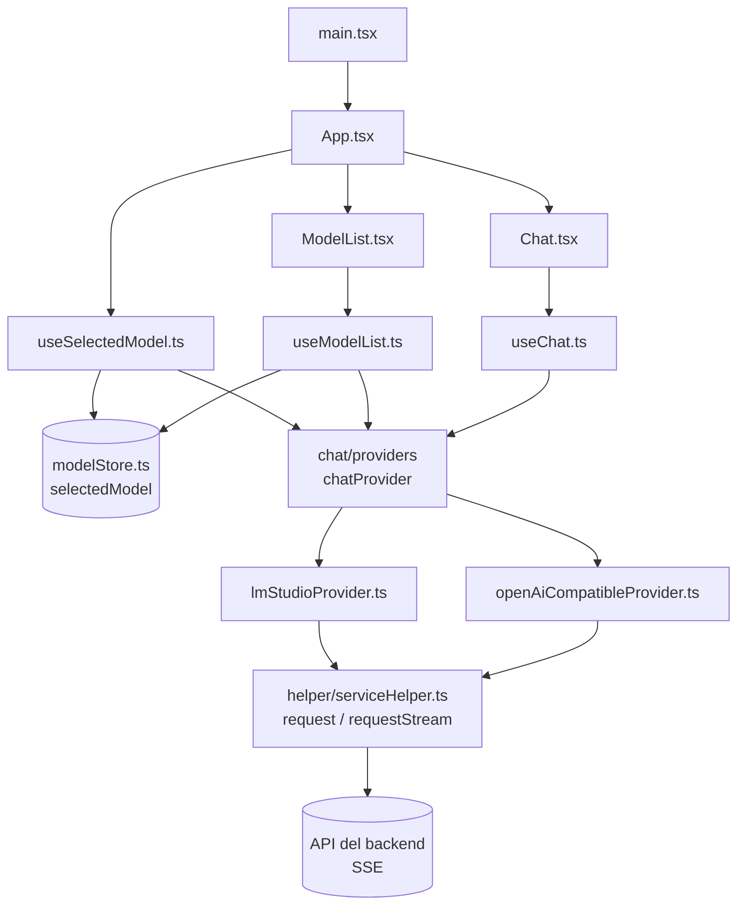
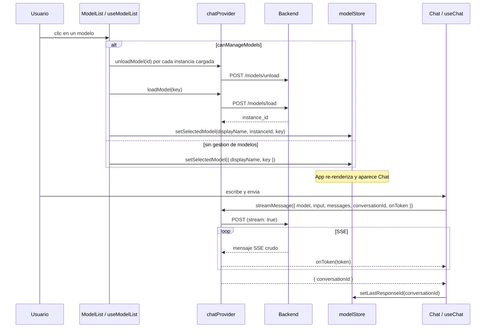

# Arquitectura de Mini Chat IA

Mini Chat IA es una SPA (React 19 + Vite + TypeScript) para chatear con modelos
de IA. El backend es **pluggable**: la app habla siempre contra un `ChatProvider`
y hoy existen dos adaptadores (LM Studio y cualquier API compatible con OpenAI).
El resto de la app no sabe -- ni necesita saber -- cual esta activo.

## Capas



## La costura de providers

Todo el borde con el backend es una sola interfaz, `ChatProvider`
(`src/chat/providers/chatProvider.contract.ts`):

| Miembro | Rol |
| --- | --- |
| `listModels()` | Devuelve los `ChatModel` del dominio interno. |
| `loadModel(key)` | Monta una instancia y devuelve `instanceId`. |
| `unloadModel(instanceId)` | Desmonta una instancia. |
| `streamMessage(params)` | Envia un turno y emite tokens por `onToken`. |
| `capabilities.canManageModels` | Indica si el provider puede montar/desmontar modelos. |

`src/chat/providers/index.ts` construye el provider activo desde un registro:

```ts
const PROVIDERS: Record<string, ProviderFactory> = {
    lmstudio: createLmStudioProvider,
    "openai-compatible": createOpenAiCompatibleProvider
};

const createProvider = PROVIDERS[PROVIDER_ID] ?? createLmStudioProvider;

export const chatProvider = createProvider({ baseUrl, apiKey });
```

`PROVIDER_ID` sale de `VITE_PROVIDER` (default `lmstudio`). Los detalles para
sumar uno nuevo estan en [`providers.md`](./providers.md).

## Transporte vs protocolo

Esta es la idea central del refactor:

- **Transporte** (`src/helper/serviceHelper.ts`): `requestStream` hace el fetch,
  lee el body y usa `eventsource-parser` para entregar cada **mensaje SSE crudo**
  (`EventSourceMessage`). No conoce ningun protocolo.
- **Protocolo** (cada adaptador): interpreta ese payload a su manera.

| Provider | Como lee el stream |
| --- | --- |
| LM Studio | `JSON.parse(message.data)`; `message.delta` aporta el token y `chat.end` el `response_id`. |
| OpenAI-compatible | Ignora `[DONE]`; toma `choices[0].delta.content`. |

Antes esto era un parser SSE hecho a mano dentro de la capa de servicio.
Hoy el transporte es generico y cada provider aporta su protocolo.

## Modelo de estado

| Estado | Ubicacion | Alcance |
| --- | --- | --- |
| `selectedModel` (`displayName`, `instanceId`, `key`, `lastResponseId`) | `src/store/modelStore.ts` (Zustand) | Compartido entre componentes |
| `messages`, `currentMessage`, `isSending` | `src/component/useChat.ts` | Local al chat |
| `models`, `loadingKey` | `src/component/useModelList.ts` | Local a la lista de modelos |
| `isUnloading` | `src/component/useSelectedModel.ts` | Local al boton de desmontar |

`lastResponseId` es el hilo de la conversacion: se guarda en el store y el
adaptador de LM Studio lo reenvia como `previous_response_id` en el proximo
turno.

## Flujo



## Endpoints por provider

| Provider | Listar | Montar | Desmontar | Chat |
| --- | --- | --- | --- | --- |
| LM Studio | `GET /models` | `POST /models/load` | `POST /models/unload` | `POST /chat` |
| OpenAI-compatible | `GET /models` | -- | -- | `POST /chat/completions` |

## Mapa de archivos

| Archivo | Responsabilidad |
| --- | --- |
| `src/main.tsx` | Punto de entrada; monta `App`. |
| `src/App.tsx` | Layout; decide si renderizar `Chat` segun el modelo seleccionado. |
| `src/component/ModelList.tsx` | Lista de modelos y accion "Montar" / "Elegir". |
| `src/component/Chat.tsx` | Mensajes e input; usa `react-markdown`. |
| `src/component/useModelList.ts` | Carga y monta modelos; desmonta al desmontar el componente. |
| `src/component/useChat.ts` | Envia mensajes y acumula tokens del stream. |
| `src/component/useSelectedModel.ts` | Modelo seleccionado y accion de desmontarlo. |
| `src/chat/providers/chatProvider.contract.ts` | Interfaz `ChatProvider` y tipos del dominio. |
| `src/chat/providers/lmStudioProvider.ts` | Adaptador LM Studio (gestiona modelos). |
| `src/chat/providers/openAiCompatibleProvider.ts` | Adaptador OpenAI-compatible (sin gestion de modelos). |
| `src/chat/providers/index.ts` | Registro `PROVIDERS` y provider activo. |
| `src/helper/serviceHelper.ts` | `request` / `requestStream`; errores (`ApiRequestError`). |
| `src/helper/modelHelper.ts` | Extrae las instancias cargadas de la lista. |
| `src/helper/chatHelper.ts` | Crea mensajes de usuario y de asistente. |
| `src/helper/toastMessages.ts` | Textos de las notificaciones. |
| `src/constants/appConstants.ts` | Env (`VITE_*`), tipo `SelectedModel` y textos base. |
| `src/constants/appConfig.ts` | Branding (`APP_NAME`, `PROVIDER_LABEL`). |
| `src/store/modelStore.ts` | Store Zustand con `selectedModel` y sus setters. |

## Notas

- `reasoning.delta` se ignora a proposito; ver el comentario en
  `src/chat/providers/lmStudioProvider.ts`.
- La URL base sale de `VITE_API_BASE_URL` y por defecto apunta a LM Studio
  (`http://192.168.1.68:1234/api/v1`) en `src/constants/appConstants.ts`.
