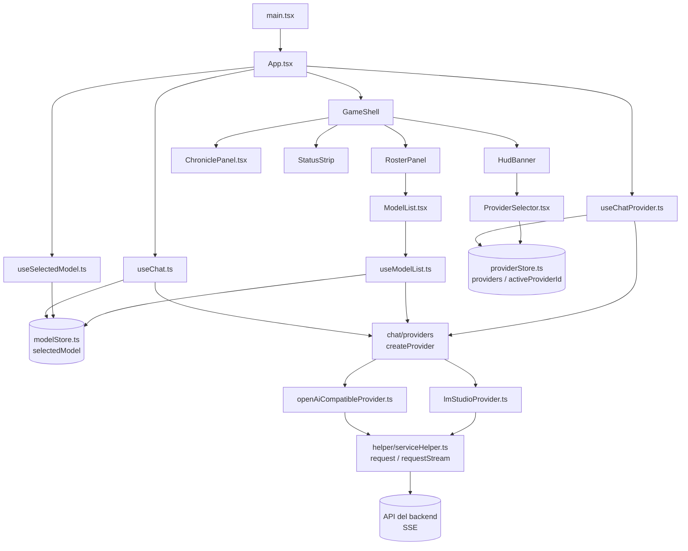
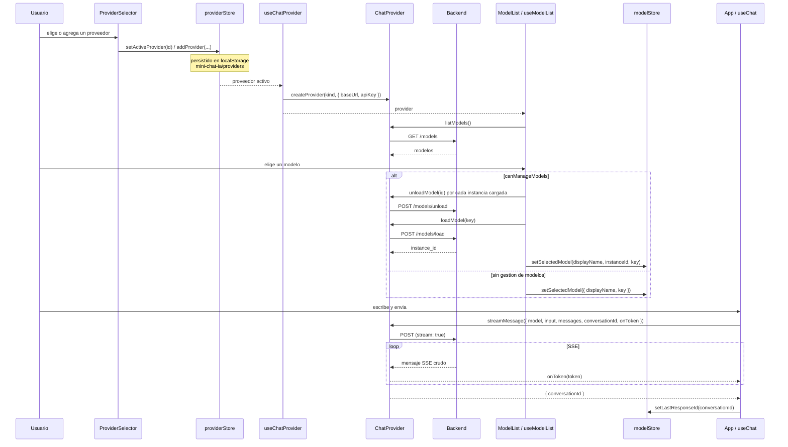

# Arquitectura de Mini Chat IA

Mini Chat IA es una SPA (React 19 + Vite + TypeScript) con una consola RPG en
8bit que chatea contra un backend **pluggable**. La app habla siempre contra un
`ChatProvider` y hoy existen dos adaptadores: LM Studio (gestiona modelos) y
cualquier API compatible con OpenAI (sin gestion de modelos). El resto de la app
no sabe -- ni necesita saber -- cual esta activo.

El proveedor se elige en la UI y se persiste en el navegador; el `.env` solo
siembra la configuracion inicial.

## Capas



`GameShell` es puro layout: recibe cuatro nodos (`hud`, `roster`, `chronicle`,
`status`) y no posee datos.

## La costura de providers

Todo el borde con el backend es una sola interfaz, `ChatProvider`
(`src/chat/providers/chatProvider.contract.ts`):

| Miembro | Rol |
| --- | --- |
| `listModels()` | Devuelve los `ChatModel` del dominio interno. |
| `loadModel(key)` | Monta una instancia y devuelve `instanceId`. |
| `unloadModel(instanceId)` | Desmonta una instancia. |
| `streamMessage(params)` | Envia un turno y emite tokens por `onToken`. |
| `capabilities.canManageModels` | Indica si el provider puede montar/desmontar modelos. |

No hay un singleton de provider. `src/chat/providers/index.ts` expone una
**factory** y un registro tipado por `ProviderKind`:

```ts
export type ProviderKind = "lmstudio" | "openai-compatible";

const PROVIDERS: Record<ProviderKind, ProviderFactory> = {
    "lmstudio": createLmStudioProvider,
    "openai-compatible": createOpenAiCompatibleProvider
};

const createProvider = (kind: ProviderKind, config: { baseUrl: string; apiKey?: string }) =>
    PROVIDERS[kind](config);
```

`src/component/useChatProvider.ts` resuelve el **proveedor activo** desde el
store, lo memoiza por `(kind, baseUrl, apiKey)` y devuelve `{ provider,
providerLabel }`. Los hooks (`useChat`, `useModelList`, `useSelectedModel`) y
los componentes consumen ese `provider`; ninguno conoce la implementacion.

Los detalles para sumar uno nuevo estan en [`providers.md`](./providers.md).

## Proveedores y persistencia

`src/store/providerStore.ts` es un store Zustand con `persist`, guardado bajo la
clave `mini-chat-ia/providers` (localStorage).

| Campo / accion | Rol |
| --- | --- |
| `providers: ProviderConfig[]` | Lista de proveedores configurados. |
| `activeProviderId` | Id del proveedor en uso. |
| `addProvider` / `updateProvider` / `removeProvider` | Alta, edicion y baja. |
| `setActiveProvider` | Cambia el proveedor activo. |

`ProviderConfig` es `{ id, kind, label, baseUrl, apiKey }`. El store **siembra**
dos proveedores por defecto:

| Id sembrado | `kind` | `baseUrl` |
| --- | --- | --- |
| `lmstudio-default` | `lmstudio` | `LM_STUDIO_DEFAULT_BASE_URL` (`http://localhost:1234/api/v1`). |
| `opencode-go-default` | `openai-compatible` | `/opencode-go` (proxy de Vite). |

El proveedor activo inicial depende de `PROVIDER_ID` (`VITE_PROVIDER`):
`openai-compatible` apunta a OpenCode Go; cualquier otro valor usa LM Studio.
`ProviderSelector.tsx` es la UI para agregar, editar, elegir y eliminar
proveedores. La API key se guarda en localStorage, no en el codigo.

## Transporte vs protocolo

- **Transporte** (`src/helper/serviceHelper.ts`): `requestStream` hace el fetch,
  lee el body y usa `eventsource-parser` para entregar cada **mensaje SSE crudo**
  (`EventSourceMessage`). No conoce ningun protocolo.
- **Protocolo** (cada adaptador): interpreta ese payload a su manera.

| Provider | Como lee el stream |
| --- | --- |
| LM Studio | `JSON.parse(message.data)`; `message.delta` aporta el token y `chat.end` el `response_id`. |
| OpenAI-compatible | Ignora `[DONE]`; toma `choices[0].delta.content`. |

## Modelo de estado

| Estado | Ubicacion | Alcance |
| --- | --- | --- |
| `providers`, `activeProviderId` | `src/store/providerStore.ts` (Zustand + `persist`) | Compartido y persistido |
| `selectedModel` (`displayName`, `instanceId`, `key`, `lastResponseId`) | `src/store/modelStore.ts` (Zustand) | Compartido entre componentes |
| `messages`, `currentMessage`, `isSending` | `src/component/useChat.ts` | Local, elevado a `App.tsx` |
| `models`, `loadingKey` | `src/component/useModelList.ts` | Local a la lista de modelos |
| `isUnloading` | `src/component/useSelectedModel.ts` | Local al boton de desmontar |
| Formulario de proveedor (`isDialogOpen`, `values`, `errors`) | `src/component/ProviderSelector.tsx` | Local al dialogo |

`lastResponseId` es el hilo de la conversacion: se guarda en el store y el
adaptador de LM Studio lo reenvia como `previous_response_id` en el proximo
turno.

## Flujo



## Endpoints por provider

| Provider | Listar | Montar | Desmontar | Chat |
| --- | --- | --- | --- | --- |
| LM Studio | `GET /models` | `POST /models/load` | `POST /models/unload` | `POST /chat` |
| OpenAI-compatible | `GET /models` | -- | -- | `POST /chat/completions` |

El proveedor sembrado "OpenCode Go" es OpenAI-compatible con `baseUrl`
`/opencode-go`. El dev server de Vite reescribe ese prefijo a
`https://opencode.ai/zen/go/v1` e inyecta el `Authorization` (desde
`OPENCODE_GO_KEY`) y los headers que el navegador no puede setear.

## Notificaciones

`src/helper/toast.ts` expone `notify(text, level?)` con niveles `info`,
`success` y `error`, implementado sobre sonner. Un unico `<Toaster />`
(`src/components/ui/sonner`) se monta una vez en `App.tsx`. Los textos salen de
`src/helper/toastMessages.ts` y de `TOAST_MESSAGES` en `appConstants.ts`.

## Tema y tipografia

La app es **siempre oscura**: `index.html` fija `class="dark"` en `<html>` y
`class="theme-sega"` en `<body>`. No hay selector de tema en runtime.

| Pieza | Donde |
| --- | --- |
| Tokens de tema y fuentes | `src/index.css` (importa Tailwind y los temas). |
| Temas vendored 8bitcn | `src/components/ui/8bit/styles/themes.css`. |
| Helper de display, `.retro` | `src/components/ui/8bit/styles/retro.css` (Press Start 2P). |
| Helper de texto, `.retro-body` | `src/index.css` (VT323, legible para mensajes). |
| Fuentes self-hosted (`.woff2`, subset latin) | `src/assets/fonts/`. |

## Mapa de archivos

| Archivo | Responsabilidad |
| --- | --- |
| `src/main.tsx` | Punto de entrada; monta `App`. |
| `src/App.tsx` | Compone `GameShell` con los cuatro slots; eleva `useChat`. |
| `src/component/GameShell.tsx` | Layout RPG de cuatro zonas; no posee datos. |
| `src/component/HudBanner.tsx` | Identidad y `ProviderSelector`. |
| `src/component/RosterPanel.tsx` | Lista de modelos y accion de desmontar. |
| `src/component/ChroniclePanel.tsx` | Mensajes e input; renderiza el log y el composer. |
| `src/component/StatusStrip.tsx` | Tira de estado (mensajes, conexion, actividad). |
| `src/component/ModelList.tsx` | Combo-box de modelos (popover + command). |
| `src/component/ProviderSelector.tsx` | Alta/edicion/seleccion de proveedores. |
| `src/component/useChat.ts` | Envia mensajes y acumula tokens del stream. |
| `src/component/useChatProvider.ts` | Resuelve y memoiza el provider activo. |
| `src/component/useModelList.ts` | Carga y monta modelos; desmonta al desmontar. |
| `src/component/useSelectedModel.ts` | Modelo seleccionado y accion de desmontarlo. |
| `src/chat/providers/chatProvider.contract.ts` | Interfaz `ChatProvider` y tipos del dominio. |
| `src/chat/providers/lmStudioProvider.ts` | Adaptador LM Studio (gestiona modelos). |
| `src/chat/providers/openAiCompatibleProvider.ts` | Adaptador OpenAI-compatible (sin gestion de modelos). |
| `src/chat/providers/index.ts` | Factory `createProvider` y registro `PROVIDERS`. |
| `src/helper/serviceHelper.ts` | `request` / `requestStream`; errores (`ApiRequestError`). |
| `src/helper/modelHelper.ts` | Extrae las instancias cargadas de la lista. |
| `src/helper/chatHelper.ts` | Crea mensajes de usuario y de asistente. |
| `src/helper/toast.ts` | `notify(text, level?)` sobre sonner. |
| `src/helper/toastMessages.ts` | Textos de las notificaciones. |
| `src/constants/appConstants.ts` | Env (`VITE_*`), tipo `SelectedModel` y textos base. |
| `src/constants/appConfig.ts` | Branding (`getAppConfig(providerLabel)`). |
| `src/store/modelStore.ts` | Store Zustand con `selectedModel` y sus setters. |
| `src/store/providerStore.ts` | Store Zustand persistido de proveedores. |
| `src/lib/utils.ts` | Reexporta `cn`. |
| `src/components/ui/**` | UI vendored 8bitcn/Radix y `<Toaster />` (`sonner`). |
| `src/index.css` | Tailwind, tokens de tema y `@font-face`. |

## Notas

- `reasoning.delta` se ignora a proposito; ver el comentario en
  `src/chat/providers/lmStudioProvider.ts`.
- El transporte usa `DEFAULT_API_BASE_URL` como fallback
  (`http://192.168.1.68:1234/api/v1`) solo si una llamada omite `baseUrl`. Los
  providers siempre pasan el `baseUrl` del proveedor activo.
- `LM_STUDIO_DEFAULT_BASE_URL` (`http://localhost:1234/api/v1`) es el default
  propio del proveedor LM Studio sembrado, independiente de `VITE_API_BASE_URL`.
- Un backend no proxeado en el dev server puede fallar por CORS.
