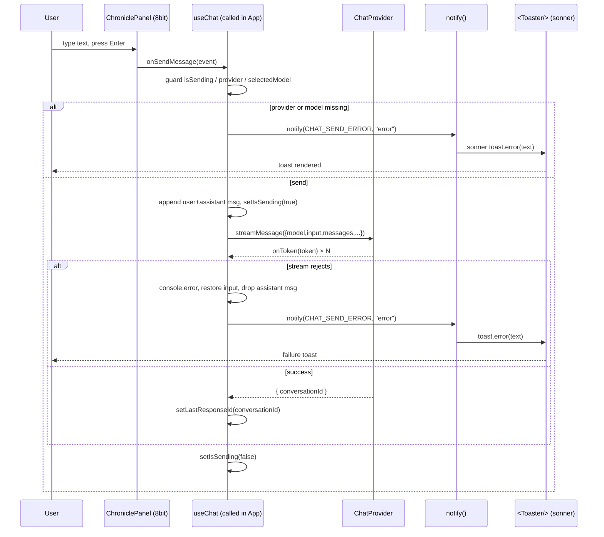

# Design: 8bitcn/ui Full UI Redesign

## Technical Approach

Presentation-layer migration **plus a full layout restructure**. Replace Ant Design v6 + four hand-written CSS files with **8bitcn/ui** (shadcn registry on Radix UI + Tailwind v4 + cva), and rebuild the screen as a **full-viewport RPG console** — top HUD banner, left roster sidebar, main chronicle/dialogue stage, bottom status strip — instead of the current centered `Layout > Card > Space` card stack. Delivered in 5 chained slices (S1–S5).

This is explicitly **not** a 1:1 swap of the existing centered stack. The composition (zones, order, proportions, hierarchy) is redesigned from scratch for RPG visual hierarchy; every element is then built from 8bitcn primitives. Non-visual layers (`src/chat/providers/**`, `src/helper/{serviceHelper,chatHelper,modelHelper}.ts`, `src/store/**`, `src/constants/**`) are contracts and stay byte-identical. antd and 8bitcn coexist S1–S4 so any slice reverts cleanly; S5 removes antd. All facts below honor `research.md` (Radix base, `combo-box` slug, 21 themes, TS 7 `paths`-only, `add` omits cva/lucide).

## Architecture Decisions

### Decision: Alias is `paths`-only

| Option | Tradeoff | Decision |
|--------|----------|----------|
| shadcn Vite guide: `baseUrl` + `paths` | Breaks `npm run typecheck` — TS 7.0.2 removed `baseUrl` (**TS5102**) | **Rejected** |
| `paths` only + `resolve.alias` in Vite | One subtlety: `@/*` must be declared in both places | **Chosen** |

**Choice**: `"paths": { "@/*": ["./src/*"] }` in `tsconfig.json` (no `baseUrl`); `resolve.alias['@'] = fileURLToPath(new URL('./src', import.meta.url))` in `vite.config.js` using `node:url` (plain JS, so no `@types/node`).
**Rationale**: the compiler probe proves `paths`-only type-checks cleanly; `baseUrl` would regress the S1 exit check.

### Decision: Tailwind v4 via the Vite plugin

**Choice**: `@tailwindcss/vite` plugin in `vite.config.js` + `@import "tailwindcss";` in `src/index.css`.
**Alternatives considered**: PostCSS pipeline (`postcss.config` + `@tailwindcss/postcss`) — rejected, Tailwind v4 does not need it and the plugin is Vite-8 peer-compatible.
**Rationale**: fewer moving parts, no `tailwind.config.js`, matches the research-verified install path.

### Decision: One fixed theme class, statically on `<html>`

**Choice**: a single `class="theme-<name>"` attribute on `<html>` in `index.html`, written statically. 8bitcn theme CSS variables are imported **once** from `src/index.css`.
**Alternatives considered**: (a) runtime `documentElement.classList.add()` effect in `main.tsx` — rejected, imperative DOM mutation with no benefit and StrictMode double-apply noise; (b) `ThemeSelector`/`RetroModeSwitcher` — rejected (D4), they pull `nuqs`/`next-themes`.
**Rationale**: theme is fixed, so a static attribute is deterministic and zero-runtime. The class must live on `<html>` (not a `#root` div) so variables cascade into body-portaled Radix content.

### Decision: Consolidate the duplicated font import

**Choice**: one font source in `src/index.css` (the 8bitcn `retro.css`/globals variable block + a **single** Press Start 2P import — **self-hosted under `src/` by default**, otherwise one Google Fonts `@import`).
**Alternatives considered**: leave the per-component `@import` injected by each vendored file — rejected, duplicates the fetch on every component.
**Rationale**: research flags per-component font injection as a network/CSP liability; consolidating removes N duplicate `@import`s.

### Decision: Vendored dir at `src/components/ui/8bit/**`, app code in `src/component/**`

**Choice**: keep the two paths distinct (`components` plural = library, `component` singular = app).
**Rationale**: shadcn `aliases.ui = "@/components/ui"` maps 8bitcn targets to `src/components/ui/8bit/**` (verified by live CLI); no collision with the existing tree.

### Decision: Toast via one `notify()` + one `<Toaster />`

**Choice**: `src/helper/toast.ts` exports `notify(text, level?: "info" | "success" | "error")` over **sonner**; a single `<Toaster />` from `src/components/ui/sonner.tsx` is mounted once in `src/App.tsx`; `src/helper/toastMessages.ts` stays the string source.
**Alternatives considered**: (a) 8bitcn `toast(string)` wrapper only — its title-only signature would drop info/success/error parity; (b) a `ToastContext`/provider — rejected, hooks are non-component and sonner is an imperative singleton.
**Rationale**: sonner variants are trivially available (spec allows variants then), preserving the current `message.info/success/error` severities while keeping a single entry point.

### Decision: Manual validation, no form dependency

**Choice**: `Field`/`FieldLabel`/`FieldError` + `useState` values/errors with trimmed-non-empty validators for `label`, `kind`, `baseUrl`.
**Alternatives considered**: `react-hook-form` + `zod` + `@hookform/resolvers` (documented shadcn standard) — rejected for v1 (3 deps for 3 fields); documented escalation.
**Rationale**: zero new deps, keeps the change presentation-only.

### Decision: Icons from `lucide-react`

**Choice**: `DownloadOutlined → Download`, `SendOutlined → Send`.
**Rationale**: `lucide-react` is already transitive (select/sonner items import it); delete `@ant-design/icons` in S5.

### Decision: Markdown container without `@tailwindcss/typography`

**Choice**: keep `react-markdown` unchanged; wrap output in a `.chat-markdown` container styled with Tailwind utilities and arbitrary child selectors (`[&_p]:…`, `[&_code]:…`, `[&_pre]:…`, `[&_ul]:…`).
**Alternatives considered**: `@tailwindcss/typography` `prose` — rejected; new dependency, and its default type scale fights the pixel font and needs heavy overrides.
**Rationale**: no new dep; full control under the fixed theme.

### Decision: Exempt vendored code without weakening app strictness

**Choice**:
- **Type**: main `tsconfig.json` adds `"exclude": ["src/components/ui/8bit"]`; a new `tsconfig.vendored.json` extends it with `noUnusedLocals:false`, `noUnusedParameters:false` and `include: ["src/components/ui/8bit"]`. `typecheck` runs both (`tsc --noEmit && tsc --noEmit -p tsconfig.vendored.json`).
- **Lint**: oxlint `overrides` entry scoped to `src/components/ui/8bit/**` turning off `react/only-export-components`.

**Alternatives considered**: relax the global compiler flags — rejected, weakens the whole app; per-file `@ts-ignore` — rejected, noisy and unmaintainable.
**Rationale**: app files keep today's strict rules; only repo-owned vendored output is exempted. Verify oxlint `overrides` support at S1 (fallback: per-file disable comments).

## Layout & Visual Hierarchy (RPG)

The screen becomes a **full-viewport game console**. Four zones with explicit visual ranks; the provider dialog is an RPG window layered above all zones.

| Rank | Zone | Component | Purpose |
|------|------|-----------|---------|
| 1 — Identity | Top HUD banner | `HudBanner.tsx` | Game-title plate of `appConfig.name`/`title`/`tagline`; the provider **loadout** selector and the configure/edit action. Largest type, banner/ribbon treatment. |
| 2 — Stage | Main chronicle/dialogue | `ChroniclePanel.tsx` | The message log as an RPG dialogue/chronicle panel (`scroll-area`) and the composer as the bottom **dialogue box** (Enter sends). Takes the largest area. |
| 3 — Party | Left roster sidebar | `RosterPanel.tsx` | Models as an RPG **roster/party**: searchable `combo-box` picker, the selected model as an **"equipped"** `Badge`, the unmount action gated by `canManageModels`. |
| 4 — Ambient | Bottom status / HUD strip | `StatusStrip.tsx` | Message count, connection state, and a `Progress` activity meter for `isSending`. Quietest rank. |

### Zoning diagram

```
┌────────────────────────────────────────────────────────────────────────────┐
│ rank 1 · HUD BANNER (identity)                                              │
│  ┌────────────────────────────┐  ┌──────────────────────┐  ┌─────────────┐ │
│  │ TITLE PLATE                │  │ PROVIDER LOADOUT      │  │ CONFIGURE   │ │
│  │ appConfig.name / title /   │  │ [Select]  [Editar]    │  │ (gear/plus) │ │
│  │ tagline (banner/ribbon)    │  │                       │  │             │ │
│  └────────────────────────────┘  └──────────────────────┘  └─────────────┘ │
├───────────────────────────┬────────────────────────────────────────────────┤
│ rank 3 · ROSTER (party)   │ rank 2 · CHRONICLE / DIALOGUE (stage)           │
│ ┌───────────────────────┐ │ ┌────────────────────────────────────────────┐ │
│ │ party frame           │ │ │ MESSAGE LOG  (scroll-area)                  │ │
│ │  search (combo-box)   │ │ │   role="log"  aria-live="polite"            │ │
│ │  model roster list    │ │ │   ┆ assistant dialogue   user shout ┆       │ │
│ │ EQUIPPED: [Badge]     │ │ └────────────────────────────────────────────┘ │
│ │ [Unmount]  (gated)    │ │ ┌────────────────────────────────────────────┐ │
│ └───────────────────────┘ │ │ DIALOGUE BOX (composer, Enter sends)        │ │
│                           │ └────────────────────────────────────────────┘ │
├───────────────────────────┴────────────────────────────────────────────────┤
│ rank 4 · STATUS / HUD STRIP                                                 │
│  messages: 12  ·  connection: OpenCode Go  ·  [██████░░░░] sending          │
└────────────────────────────────────────────────────────────────────────────┘
        Dialog overlay (ProviderSelector) = framed RPG window above all zones
```

### Layout decisions

- **Provider loadout lives in the HUD, not duplicated.** The brief mentions the provider "loadout" in both the HUD and the roster. To avoid two competing controls, the **provider selector + configure/edit** is the primary HUD control (identity zone), while the **roster sidebar presents the model party** (picker, equipped badge, unmount). The active provider appears in the roster only as a quiet guild/context label, never as a second selector.
- **No gratuitous meters.** A single tasteful `Progress` bar in the status strip reflects the `isSending` activity. We do **not** fabricate XP/mana/health values from unrelated state.
- **Hierarchy comes from structure, not decoration.** Rank is expressed through grid area, size, and the pixel-font chrome; the message body (readable long-form text) keeps standard sizing so the pixel font never hurts readability.
- **Zones are frames, primitives are content.** `GameShell`/`HudBanner`/`RosterPanel`/`ChroniclePanel`/`StatusStrip` own placement and chrome; 8bitcn primitives (below) are what each frame is built from.

### Responsive collapse

| Breakpoint | Behavior |
|------------|----------|
| `lg` and up (≥1024px) | Two-column grid: HUD spans both columns; roster is a fixed left rail; chronicle fills the remaining column; status strip spans both columns. |
| `md` (768–1023px) | Roster collapses to a slim rail / toggleable panel above the chronicle; chronicle keeps full width. |
| `< md` | Single column stack in rank order: HUD → roster (collapsible) → chronicle → status. Composer stays pinned to the viewport bottom. |

Sketch (Tailwind v4 utilities, `h-dvh` grid):

```
grid h-dvh grid-cols-1 grid-rows-[auto_1fr_auto]
  md:grid-cols-[minmax(240px,300px)_1fr]
  HUD      → md:col-span-2
  ROSTER   → left column
  CHRONICLE→ main column
  STATUS   → md:col-span-2
```

## Component Decomposition

All app components stay under `src/component/**`; the 8bitcn library stays under `src/components/ui/8bit/**`. The existing `useChat.ts`, `useChatProvider.ts`, `useModelList.ts`, `useSelectedModel.ts` keep their paths.

| Component (`src/component/`) | Status | Implements | Notes |
|------------------------------|--------|------------|-------|
| `App.tsx` | Modified | Shell orchestrator | Calls `useChatProvider`, `useSelectedModel`, and **lifts `useChat`** (see Data Flow); mounts the single `<Toaster />`; passes zone nodes to `GameShell`. |
| `GameShell.tsx` | **New** | Shell / grid | Pure presentational full-viewport grid; receives `hud`/`roster`/`chronicle`/`status` nodes. No data. |
| `HudBanner.tsx` | **New** | Zone rank 1 | Title plate from `appConfig` + provider loadout via `ProviderSelector` + configure action. |
| `RosterPanel.tsx` | **New** | Zone rank 3 | Party/roster frame hosting `ModelList`; equipped `Badge`; gated unmount button. |
| `ChroniclePanel.tsx` | **New** (absorbs `Chat.tsx`) | Zone rank 2 | Dialogue log + composer; owns the render of chat state passed from `App`. |
| `StatusStrip.tsx` | **New** | Zone rank 4 | Message count, connection label, `Progress` for `isSending`. |
| `ModelList.tsx` | Modified | Roster model picker | Internals → 8bitcn `combo-box` + loading/empty guards. |
| `ProviderSelector.tsx` | Modified | Loadout + RPG-window dialog | Provider `Select` + framed `Dialog` + manual `Field`/`FieldError` CRUD. |
| `Chat.tsx` | **Removed in S4** | — | Render logic absorbed by `ChroniclePanel`; `useChat.ts` hook stays. |

`App.css`, `Chat.css`, `ModelList.css`, `ProviderSelector.css` are deleted as their owners migrate (S2–S5).

## Primitive Mapping

Each element is still built from these 8bitcn primitives (this table is the *how*, separate from the *where* above).

| antd primitive | 8bitcn / replacement | Prop or shape change |
|---|---|---|
| `Layout`/`Content` | `GameShell` `<div>` grid + Tailwind utilities | `className` rules → layout utilities |
| `Card type="inner"` | 8bit `Card` (+ header/content composition) | `type`/`bordered` → composition; title → child |
| `Tag` | 8bit `Badge` | `color` → `variant` |
| `Typography.*` | `h2`/`p`/`span` + utilities | `level`/`type="secondary"` → font utilities |
| `Flex`/`Space` | `div` + `flex`/`gap-*`/`justify-*` | `direction`/`align`/`wrap` → utilities |
| `Space.Compact` | `div` + flex utilities | — |
| `Input` | 8bit `Input` | same `value`/`onChange`/`disabled`/`placeholder` |
| `Input.Password` | 8bit `Input type="password"` | `autoComplete="off"` preserved |
| searchable `Select` | 8bit `combo-box` (cmdk) | `options` → items; `showSearch` → built-in filter; add disabled/loading guard |
| `Select` (kind/provider) | 8bit `Select` | `options` mapping kept |
| `Modal` | 8bit `Dialog` | `open`/`onOpenChange`; `okText`/`cancelText` → footer buttons |
| `Form` + `rules` | manual `Field`/`FieldLabel`/`FieldError` | `name`/`rules` → `value`/`error` + validator |
| `Button` | 8bit `Button` | `type`→`variant`, `danger`→`destructive`, `loading`→`Spinner` + `disabled`, `htmlType`→`type` |
| `Spin` | 8bit `Spinner` | `size` |
| `message.*` | `notify()` (`src/helper/toast.ts`) | `message.error(x)` → `notify(x, "error")` |
| `DownloadOutlined`/`SendOutlined` | lucide `Download`/`Send` | `icon` prop |
| message log container | 8bit `scroll-area` | `role="log"` + `aria-live="polite"` preserved on the area |
| sending indicator | 8bit `Progress` | boolean `isSending` → activity meter (no fake %) |

## File Structure and Resting Places

```
components.json                 (Create, repo root — shadcn config + @8bitcn registry)
src/lib/utils.ts                (Create — cn helper)
src/components/ui/8bit/**       (Create — vendored: button, card, input, textarea, label,
                                 select, combo-box, dialog, badge, progress, spinner,
                                 toast, scroll-area, ...)
src/components/ui/sonner.tsx    (Create — <Toaster /> wrapper)
src/helper/toast.ts             (Create — notify())
src/component/GameShell.tsx     (Create — full-viewport RPG grid shell)
src/component/HudBanner.tsx     (Create — rank 1 HUD banner)
src/component/RosterPanel.tsx   (Create — rank 3 roster/party sidebar)
src/component/ChroniclePanel.tsx(Create — rank 2 dialogue/chronicle stage)
src/component/StatusStrip.tsx   (Create — rank 4 status/HUD strip)
src/index.css                   (Modify — tailwind import + theme vars + one font import)
tsconfig.json / tsconfig.vendored.json (Modify / Create — paths + vendored exemption)
vite.config.js                  (Modify — tailwind plugin + @ alias)
package.json                    (Modify — add/remove deps + typecheck script)
index.html                      (Modify — static .theme-* on <html>)
src/main.tsx                    (Modify — drop antd/dist/reset.css import)
src/App.tsx                     (Modify — orchestrator: hooks + <Toaster /> + zone composition)
src/component/Chat.tsx          (Remove in S4 — absorbed by ChroniclePanel)
src/component/ModelList.tsx     (Modify — roster model picker)
src/component/ProviderSelector.tsx (Modify — loadout + RPG-window dialog)
src/component/{useChat,useChatProvider,useModelList,useSelectedModel}.ts (paths unchanged)
src/{App.css, component/*.css}  (Delete by S5)
```

Hooks `useChat.ts`, `useChatProvider.ts`, `useModelList.ts`, `useSelectedModel.ts` keep their paths. `useChat.ts`, `useModelList.ts`, `useSelectedModel.ts` change only their notification import/call; `useChatProvider.ts` is unchanged.

## Interfaces / Contracts

```ts
// src/helper/toast.ts
type NotifyLevel = "info" | "success" | "error";
export function notify(message: string, level?: NotifyLevel): void;

// ProviderSelector local validation (no external schema)
interface ProviderFormValues { label: string; kind: ProviderKind; baseUrl: string; apiKey?: string; }
type ProviderFormErrors = Partial<Record<"label" | "kind" | "baseUrl", string>>;
```

New app-component contracts (types imported from existing modules):

```ts
// src/component/GameShell.tsx — pure layout
interface GameShellProps {
    hud: React.ReactNode;
    roster: React.ReactNode;
    chronicle: React.ReactNode;
    status: React.ReactNode;
}

// src/component/HudBanner.tsx
interface HudBannerProps { appConfig: AppConfig; providerLabel: string; }

// src/component/RosterPanel.tsx
interface RosterPanelProps {
    selectedModel: SelectedModel;
    canManageModels: boolean;
    isUnloading: boolean;
    onUnloadModel: () => void;
}

// src/component/ChroniclePanel.tsx
interface ChroniclePanelProps {
    selectedModel: SelectedModel;
    messages: ChatMessage[];
    currentMessage: string;
    isSending: boolean;
    onSendMessage: (event: React.FormEvent<HTMLFormElement>) => void;
    onChangeInputText: (event: React.ChangeEvent<HTMLInputElement>) => void;
}

// src/component/StatusStrip.tsx
interface StatusStripProps { messageCount: number; connectionLabel: string; isSending: boolean; }
```

Store contract, `ProviderConfig`, `ProviderKind`, and the `mini-chat-ia/providers` persistence key are unchanged.

## Data Flow

Theme and portal inheritance (why the class must be on `<html>`):

```
<html class="theme-<name>">  ──CSS vars──►  body  ──►  #root (GameShell)
                                              └────►  Radix portal nodes (Dialog/Select/combo-box)
```

State topology for the shell (change from today):

```
App.tsx
 ├─ useChatProvider()  ──► provider / providerLabel   (HUD, status)
 ├─ useSelectedModel() ──► selectedModel / isUnloading (roster)
 └─ useChat(...)        ──► messages / isSending        (chronicle, status)   ← LIFTED from Chat.tsx
        │
        ├─ ► ChroniclePanel (log + composer)
        └─ ► StatusStrip (messageCount + sending Progress)
```

**Lifted-hook decision.** The shell-wide `StatusStrip` needs `messageCount` and `isSending`, which today live inside `useChat` called by `Chat.tsx`. `useChat.ts` is unchanged; only its **call site** moves from `Chat.tsx` to `App.tsx`, and the returned state flows as props into `ChroniclePanel` and `StatusStrip`. Consequence: because `Chat.tsx` no longer unmounts on model deselect, messages persist across a model change instead of being discarded. This does not touch any protected invariant (persistence key, live region, Enter-to-send, `canManageModels` gating) and is accepted as part of the restructure. If reset-on-switch is later required, scope the hook back into `ChroniclePanel` (no hook change) or add an explicit reset (deferred, would extend the hook's surface).

Migration swaps only the render/notification edge:

```
App (8bit) ──► hooks ──► provider/store ──► hooks ──► App ──► zone components
                                              └──► notify() ──► sonner <Toaster />
```

## Sequence Diagrams

### Chat send that emits a failure toast



### Provider dialog CRUD

```mermaid
sequenceDiagram
    participant U as User
    participant PS as ProviderSelector
    participant D as Dialog (Radix portal)
    participant S as providerStore (persist)

    U->>PS: click "Agregar"
    PS->>PS: reset values/errors, editing = null
    PS->>D: setOpen(true)
    D-->>U: focus trapped in dialog
    U->>D: fill label / kind / baseUrl
    U->>D: submit
    PS->>PS: validate(trimmed label, kind, trimmed baseUrl)
    alt invalid field
        PS->>D: render FieldError for that field
        Note over PS,S: no store write
    else valid
        PS->>S: addProvider({label,kind,baseUrl,apiKey})
        S-->>PS: new id
        PS->>S: setActiveProvider(id)
        PS->>D: setOpen(false)
    end
    Note over U,PS: Edit populates from active provider and updateProvider(id, payload)
    Note over U,PS: Delete visible only when providers.length > 1; removeProvider(id) then close
```

**Radix portal behavior**: Radix `Dialog`/`Select`/`combo-box` append to `document.body` (like antd `Modal`) with a built-in focus trap, `Esc` close, and overlay/content `z-50`. Integration point: the `.theme-*` class and CSS variables live on `<html>`, an ancestor of `body`, so portaled content inherits them; no stacking conflict because the shell defines no competing fixed overlays.

## Invariants (must not regress)

- localStorage key `mini-chat-ia/providers` still persists providers across reload.
- Message log keeps `role="log"` and `aria-live="polite"`.
- Composer sends on Enter and is blocked while a send is running.
- The unmount control renders only when `capabilities.canManageModels === true`.
- Non-visual layers are unchanged: `src/chat/providers/**`, `src/helper/{serviceHelper,chatHelper,modelHelper}.ts`, `src/store/**`, `src/constants/**`.
- Exactly one `.theme-*` class on `<html>`; no `nuqs`/`next-themes` in the dependency tree.
- Exactly one `<Toaster />` mounted; `notify()` is the only notification entry point.

## Testing Strategy

No test runner is configured (`strict_tdd: false`); verification is static + manual.

| Layer | What | Approach |
|-------|------|----------|
| Static | lint/typecheck/build green every slice | `npm run lint && npm run typecheck && npm run build` |
| Manual | provider CRUD persists across reload under `mini-chat-ia/providers` | create → reload → still active |
| Manual | filter + async model load; disabled while loading/empty | type query, observe filtering |
| Manual | `role="log"` + `aria-live="polite"`; Enter sends, Enter ignored while sending | inspect DOM + send |
| Manual | send failure → toast via single `<Toaster />`; `canManageModels` gating unchanged | force failure, inspect tree |
| Manual | RPG zones render at `lg`, collapse at `md`, stack below `md`; composer reachable on narrow viewport | resize devtools across breakpoints |

## Threat Matrix

N/A — no routing, shell/subprocess, VCS/PR automation, executable-file classification, or process-integration boundary.

## Slice-by-Slice Delivery

Each slice is a reviewable work unit with an independent rollback. The toolchain slice alone may approach the 400-line budget.

| Slice | Concrete change | Exit check |
|-------|-----------------|------------|
| **S1 Toolchain** | Add `@tailwindcss/vite` plugin + `@import "tailwindcss"`; `paths`-only alias + Vite `resolve.alias`; `components.json`, `src/lib/utils.ts`; explicit `class-variance-authority` + `lucide-react`; vendored tsconfig/oxlint exemptions; `--dry-run` then real `add` of the 8bit items | `lint`, `typecheck`, `build` pass; app visually unchanged (antd still renders) |
| **S2 Shell & Layout Restructure** | **New**: `GameShell.tsx`, `HudBanner.tsx`, `RosterPanel.tsx`, `ChroniclePanel.tsx`, `StatusStrip.tsx`. Rewrite `src/App.tsx` to compose the four RPG zones and **lift `useChat`**; static `.theme-*` on `<html>`; delete `App.css`. Existing antd content (`ProviderSelector`, `ModelList`, `Chat`) is hosted inside the new zone frames so the app keeps working. | App renders in the full-viewport RPG shell on 8bitcn while antd primitives still fill the zones; `canManageModels` branching intact; `lint`/`typecheck`/`build` green |
| **S3 Roster & Dialog Windows** | `ModelList.tsx` → 8bitcn `combo-box` inside `RosterPanel`; equipped `Badge`; gated unmount button (lucide `Download`); `ProviderSelector.tsx` → framed RPG-window `Dialog` + manual `Field`/`FieldError`; delete `ModelList.css`, `ProviderSelector.css` | Model + provider CRUD works end-to-end; reload persists under `mini-chat-ia/providers` |
| **S4 Chronicle, Composer & Toast** | `ChroniclePanel` message log (`scroll-area`, `role="log"`+`aria-live="polite"`), dialogue-box composer (Enter sends), message bubbles, status `Progress` for `isSending`; add `notify()` + `<Toaster />`; swap `message.*` call sites in `useChat.ts`, `useModelList.ts`, `useSelectedModel.ts` (call-only); delete `Chat.css`; **remove `Chat.tsx`** (absorbed). | Send/failure toasts fire; streaming list and live region intact; Enter-to-send preserved; status strip shows count + activity |
| **S5 Delete antd** | Remove `antd` + `@ant-design/icons` deps and `antd/dist/reset.css` import in `src/main.tsx`; delete leftover CSS | Build green; `grep` finds no antd imports |

New app component files land in **S2**; S3 rewrites existing `ModelList`/`ProviderSelector`; S4 removes `Chat.tsx` and adds `src/helper/toast.ts` + `src/components/ui/sonner.tsx`.

## Migration / Rollout

No data migration. Phased rollout via chained PRs (one per slice, per work-unit-commits). Rollback = revert the slice's merge commit; S1 is additive and reverts without touching UI; antd/8bitcn coexistence protects S1–S4. S2 changes layout structure but not data contracts, so it reverts cleanly while antd primitives remain. S5 is the only hard-to-reverse step — keep S1–S4 green before merging it. CLI failure fallback: fetch `https://8bitcn.com/r/<slug>.json` and vendor files manually (research recipe).

## Open Questions

- [ ] Confirm oxlint `overrides` syntax in this version at S1; fallback to per-file disable comments if unsupported.
- [ ] Confirm the Press Start 2P self-hosting layout under `src/` (chosen default) meets any offline/CSP requirement; otherwise fall back to a single Google Fonts `@import`.
- [ ] Chosen 8bitcn theme name for the static `.theme-*` class (one of the 21); pick during S2 against the rendered HUD.
